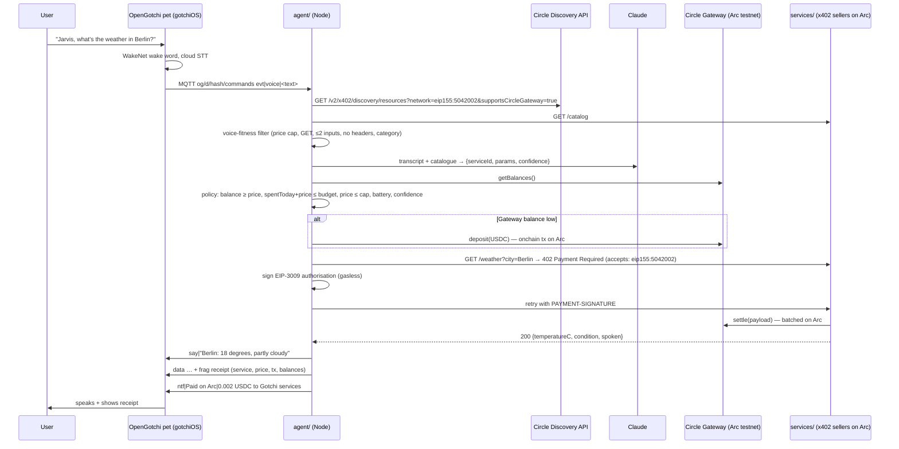

# Architecture

## Decision logic (policy.ts)

| Signal | Source | Rule |
|---|---|---|
| confidence | planner output | < 0.6 → ask again |
| price | seller's live 402 / catalogue | > `MAX_PRICE_USD` → decline |
| spent today | ledger.json | spent + price > `DAILY_BUDGET_USD` → decline |
| Gateway balance | `GatewayClient.getBalances()` | < price → decline; < `MIN_GATEWAY_USD` → deposit first |
| battery | device telemetry | < 15 % → only `PET_CARE` purchases |

A second guard runs inside the payment path (`onBeforePaymentCreation`) so
that no signed authorisation can exceed the per-payment cap even if the planner
or catalogue is wrong.

## Why Gateway nanopayments on Arc

Prices are $0.001–$0.005. A per-call onchain transfer would cost more in gas
than the item. Gateway lets the buyer sign offchain and the seller settle in
batches on Arc, so sub-cent purchases are viable and the buyer needs no gas
after the one deposit.
