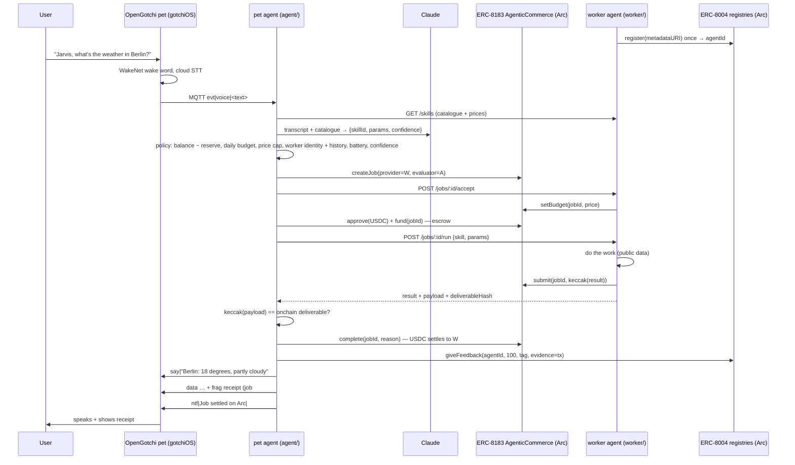

# Architecture

## Decision logic (agent/src/policy.ts)

| Signal | Source | Rule |
|---|---|---|
| confidence | planner output | < 0.6 → ask again |
| worker identity | worker `/skills` → ERC-8004 agentId | missing → refuse to pay |
| price | worker catalogue, re-checked against onchain `setBudget` | > `MAX_PRICE_USD` → decline; onchain quote above catalogue → abort |
| spent today | ledger.json | spent + price > `DAILY_BUDGET_USD` → decline |
| USDC balance | `balanceOf` on Arc | balance − price < `MIN_RESERVE_USD` → decline |
| worker history | ledger (completed jobs with this provider) | 0 jobs → only jobs ≤ half the cap |
| battery | device telemetry | < 15 % → only `snack` |
| deliverable | `getJob().status` + hash compare | mismatch → never `complete()` |

## Why ERC-8183 jobs rather than direct transfers

A transfer moves money; a job moves money *conditionally*. Escrow means the
worker knows it will be paid, the hash-on-submit means the pet can prove what
it paid for, and `complete()` is the pet's evaluation. That is the shape Arc
documents for agent-to-agent work, and it gives the policy engine real onchain
state to reason about.
